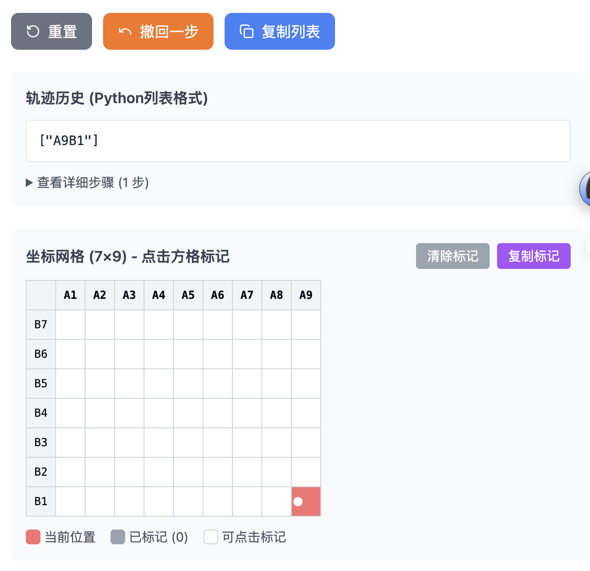
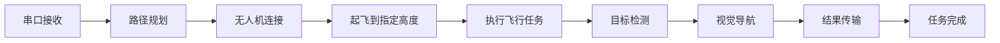

# 野生动物检测系统

### 说明

- `claude code`辅助编程
- 使用mavsdk-python控制, 代码逻辑清晰
- 室内飞行land模式下，`land` 模式会原地旋转, 使用`kill` 方法进行降落
- 路径规划借助工具人为规划, 简洁高效



## 系统特性

- **自主飞行控制** - 基于MAVSDK-Python的精准路径跟踪
- **实时目标检测** - YOLO模型检测野生动物（大象、猴子、孔雀、狼、老虎）
- **视觉导航系统** - PID控制的视觉伺服算法
- **地面站集成** - 串口实时接收航点和禁飞区指令
- **智能路径规划** - 多算法优化飞行路径，支持障碍物避让
- **完整调试工具集** - 丰富的GUI调试和测试工具

## 核心架构

### 主要模块结构

```
temp/
├── main.py                    # 主控制器 - 系统入口点
├── mycontrol/                 # 飞行控制核心
│   ├── drone_ctrl.py          # 主飞行控制器 (A1B1-A9B7网格系统)
│   └── control.py             # 底层控制逻辑和坐标转换
├── gc/                        # 路径规划系统
│   ├── plan_pro_max.py        # 高级路径规划算法
│   └── visual.py              # 路径可视化工具
├── vision/                    # 视觉系统
│   ├── cv/mono_camera.py      # 视觉导航和PID控制
│   └── yolo/detect.py         # YOLO目标检测引擎
├── lib/                       # 硬件接口层
│   ├── ser.py                 # 串口通信管理
│   ├── LED_Flash.py           # LED控制
│   └── RealSenseCamera.py     # 深度相机集成
└── util/                      # 开发调试工具集
    ├── run_camera_tools.py    # 工具集启动器
    ├── camera_tools_gui.py    # 统一GUI界面
    └── camera_*.py            # 各种专用调试工具
```

## 快速开始

### 环境要求

```bash
# 核心飞行控制依赖
pip install mavsdk opencv-python numpy matplotlib asyncio

# GUI调试工具依赖
pip install PyQt5 psutil

# 硬件接口依赖
pip install pyserial onnxruntime
```

### 系统启动

```bash
# 启动完整系统 (推荐)
python3 main.py

# 启动调试工具集
cd util/
python3 run_camera_tools.py

# 路径规划测试
cd gc/
python3 plan_pro_max.py
```

## 开发和调试工具

### 摄像头工具套件 (`util/`)

**智能启动器** - `run_camera_tools.py`

- 自动依赖检查和安装
- 一键启动完整GUI工具集
- Python版本检测和兼容性检查

**核心调试工具：**

- **设备扫描器** - 检测可用摄像头设备
- **性能测试器** - 压力测试和性能基准测试  
- **视频录制器** - 多格式录制和回放
- **截图工具** - 实时截图和图像处理
- **参数调节器** - 实时分辨率和参数调节
- **多摄像头对比** - 并行设备性能对比
- **颜色空间测试** - 颜色空间转换测试

### 专用测试脚本

```bash
# 视觉系统调试
util/mine/test_vision_crop.py     # 视觉裁剪和处理测试
util/mine/test_camera_index.py    # 摄像头索引检测

# 系统组件测试
vision/cv/mono_camera.py          # 视觉导航系统独立测试
vision/yolo/detect.py             # YOLO检测引擎测试
```

## 主函数详细分析

### `main.py` 核心流程

```python
async def run():
    # 串口通信初始化 (47-83行)
    ser_port = SerialPort(port=None, baudrate=9600)  # 自动探测串口
    # 接收禁飞区指令: mylist = content.split(',')
    
    # 路径规划 (80-82行) 
    routine = plan_pro_max.get_mapping_result(tuple(sorted(mylist)))
    
    # 无人机连接和武装 (84-114行)
    drone = System()
    await drone.connect(system_address="udp://127.0.0.1:14540")
    await drone.action.arm()
    await drone.offboard.start()
    
    # 飞行控制执行 (116-125行)
    drone_ctrl = ctrl.Drone_Controller(routine)
    await drone_ctrl.goto_position_ned(drone, 0.0, 0.0, -2.0, 0.0, 0)  # 起飞
    await drone_ctrl.pilot_plan(drone, ser_port)  # 执行主要飞行任务
```

### 主函数外的调试工具

**注释掉的调试函数：**

- `get_current_position()` (33-41行) - 获取实时NED坐标位置
- 紧急降落测试代码 (127-131行) - kill指令测试

**实时监控功能：**

- 起飞过程高度反馈 (118-122行)
- 全局变量`mylist`存储禁飞区数据 (137行)

## 工作流程



### 详细执行步骤

1. **串口命令接收** - 地面站发送禁飞区列表 (格式: "A1B1,A2B2,A3B3")
2. **智能路径规划** - 根据禁飞区从92种预设路径中选择最优方案
3. **精准飞行控制** - 按A1B1-A9B7网格系统执行路径跟踪
4. **实时目标检测** - YOLO检测5种竞赛动物
5. **视觉导航接近** - PID控制的视觉伺服系统
6. **数据回传** - 格式化检测结果发送 (如: "A8B1e2m0p1w0t0")

## 技术架构深度解析

### 坐标系统设计

- **A1B1-A9B7网格映射** - 标准化63个航点位置
- **NED坐标转换** - `mytf()`函数实现坐标系变换
- **实时位置反馈** - 高精度位置跟踪和状态监控

### 视觉系统架构

```python
# 视觉检测流水线
YOLO动物检测 → 目标定位 → PID视觉伺服 → 精确接近 → 继续任务
```

### 路径规划算法

- **增强贪心算法** - 最短路径优化
- **螺旋模式** - 系统性区域覆盖
- **之字形模式** - 高效扫描模式
- **动态避障** - 实时禁飞区处理

## 开发指南

### 关键Bug修复提醒

**必须修复的已知问题：**

1. **`mytf()`函数调用** - 必须使用`ctrl.Drone_Controller.mytf()`
2. **`pilot_plan()`参数** - 接收(drone, ser_port)但内部自动初始化相机
3. **数组越界** - `drone_ctrl.py:275`的`self.path_label[i]`需改为`[i-1]`

### 硬件配置要求

```yaml
无人机通信:
  连接方式: "udp://127.0.0.1:14540"  # 仿真
  协议: MAVLink via MAVSDK-Python
  
相机设备:
  默认ID: 0
  分辨率: 640x480
  帧率: 可配置
  缓冲: 1帧优化
  
串口通信:
  端口: /dev/ttyUSB0 (自动探测)
  波特率: 9600
  格式: 自定义数据包协议
```

### 测试建议流程

```bash
# 1. 设备检测
python3 util/camera_device_scanner.py

# 2. 视觉系统测试  
python3 vision/cv/mono_camera.py

# 3. 路径规划验证
python3 gc/plan_pro_max.py

# 4. 完整系统集成测试
python3 main.py
```

### 目标动物检测

- **训练模型**: `vision/yolo/best9999.onnx`
- **支持动物**: ['elephant', 'monkey', 'peacock', 'wolf', 'tiger']

### 标准化数据格式

- **输入格式**: 禁飞区列表 "A1B1,A2B2,A3B3"
- **输出格式**: 检测结果 "A8B1e2m0p1w0t0" (位置+各动物数量)
- **一次检测原则**: 每航点仅检测一次，避免重复